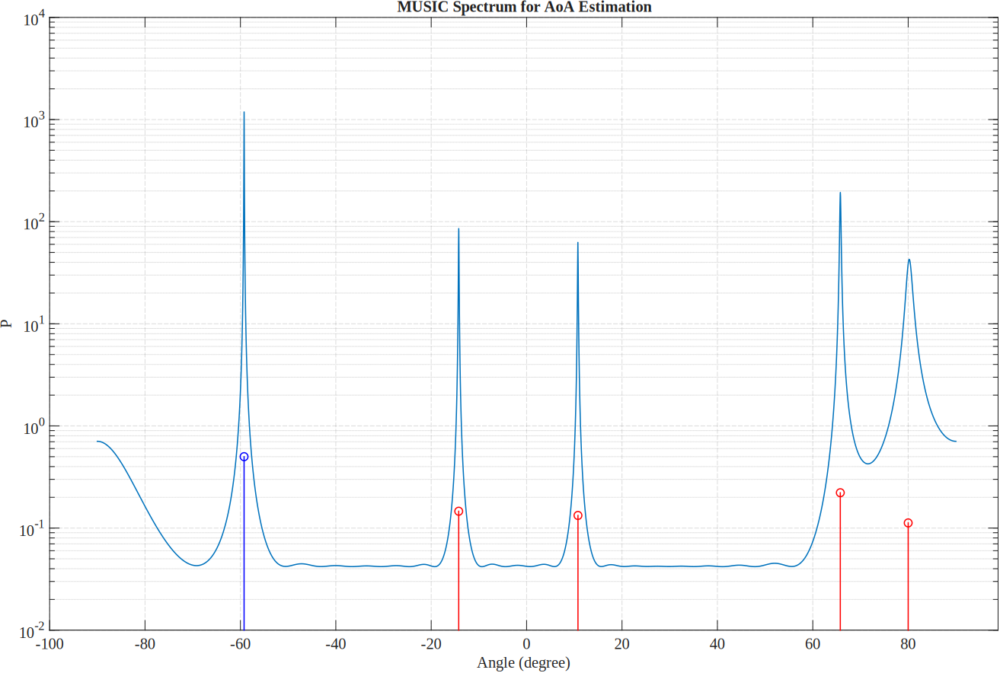
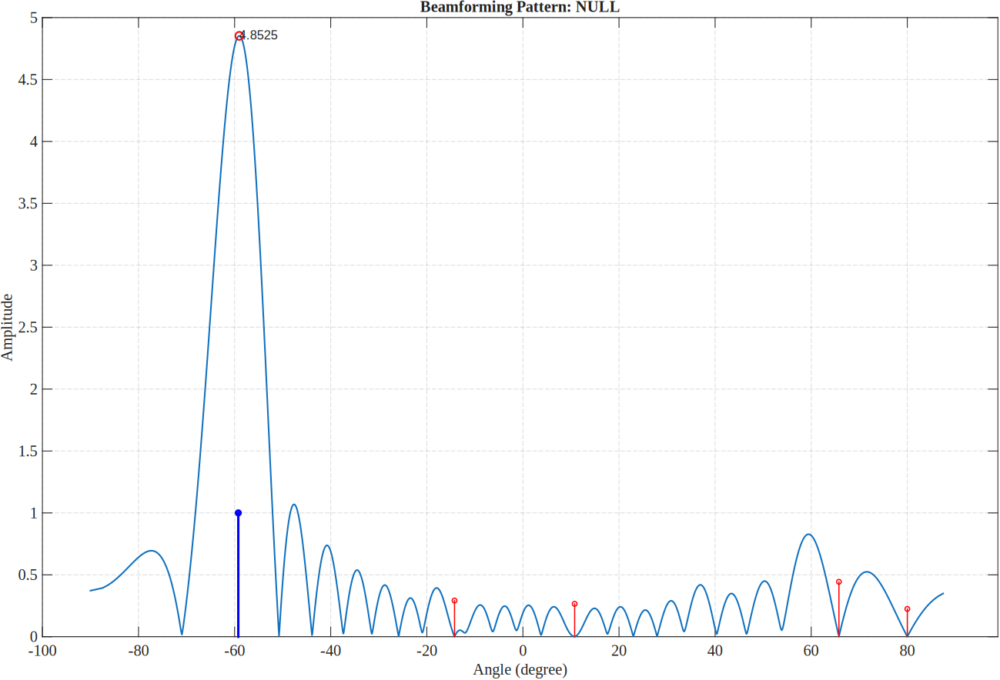
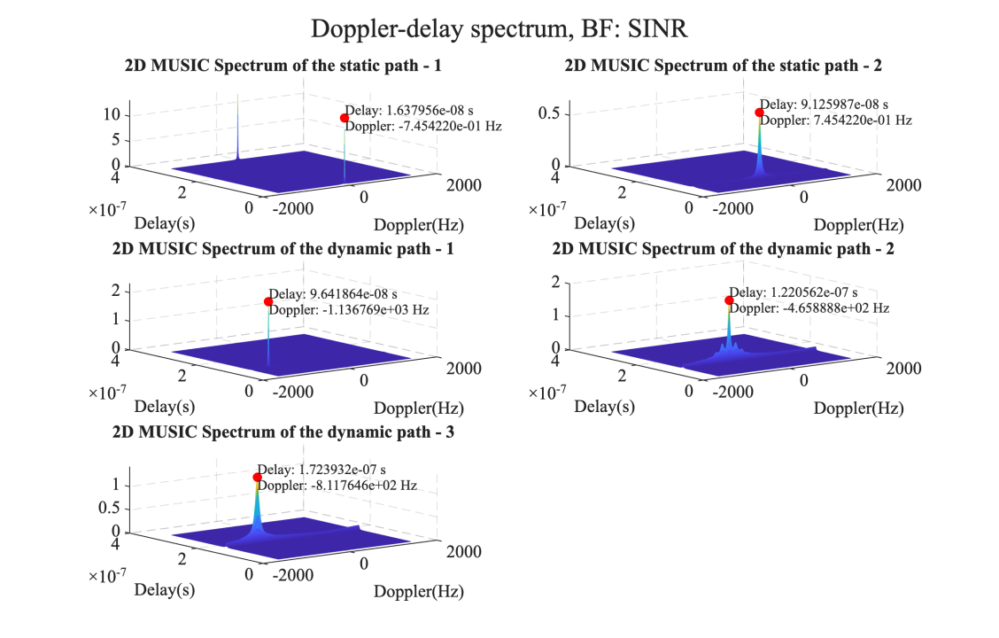

# High-Resolution Uplink Sensing in Millimeter-Wave ISAC Systems
[](https://opensource.org/licenses/MIT) [](https://www.mathworks.com/) [](https://arxiv.org/abs/2503.10107)

## Introduction

This repository provides a demonstrative implementation of the algorithms presented in the paper ["High-Resolution Uplink Sensing in Millimeter-Wave ISAC Systems"](https://arxiv.org/abs/2503.10107). The code simulates an uplink sensing framework based on millimeter-wave hybrid arrays, enabling high-precision target parameter estimation.


The simulation generates a scene with $L_s$ static targets and $L_d$ dynamic targets, each with different distances, velocities, and angles of arrival (AoA). The system first performs high-resolution AoA estimation followed by AoA-based 2D-FFT-MUSIC (AB2FM) for target parameter estimation.

Key features of this implementation include:
1. **High-resolution AoA estimation** using MUSIC algorithm based on frequency domain smoothing.
2. **Line-of-Sight (LoS) path detection**.
3. **Multiple beamforming strategies**, including Bartlett beamformer, Null-Space method, SINR optimization method, and hybrid approaches.
4. **AoA-based 2D-FFT-MUSIC (AB2FM)** algorithm for joint Doppler-delay estimation, enabling accurate recovery of all target parameters (angles, distances, velocities).

The implementation allows for flexible configuration of system parameters and scenario complexity.

## Parameters

Basic parameters are defined in `Main.m`
```matlab
Ls            = 2;              % Number of static paths
Ld            = 3;              % Number of dynamic paths
L             = Ld + Ls;        % Total number of paths
EbN0_dB       = 10;             % Signal to noise ratio in dB
BF_type       = 'SINR';         % Beamforming type: 'SINR', 'NULL', 'BART', 'HYBD'
```

Advanced parameters are defined in `Params.m`
```matlab
Nr       = 24;     % Number of antennas
Snap_AoA = 50;     % Number of snapshots for Angle of Arrival estimation
Snap_DD  = 10;     % Number of snapshots for Doppler-delay estimation
K        = 32;     % Number of subcarriers
M        = 32;     % Length of each frame (symbols per frame)
Tm       = 1024;   % Interval between two frames (in samples)
fc       = 26e9;   % Carrier frequency, 26 GHz (mmWave band)
D_f      = 100e6 / K;  % Subcarrier spacing (Hz)
Ts       = 1 / D_f;    % Sampling interval (s), equal to symbol duration
c        = 3e8;    % Speed of light (m/s)
```

Note that `L` should be less than `Nr` and `K/2`.

## Result Visualization

### MUSIC Spectrum for AoA Estimation
{width=70%}

### Beam Pattern
{width=70%}

### 2D-MUSIC Spectrum for Doppler-Delay Estimation
{width=70%}

## Citation

If you use this code in your research, please cite our paper:

```
@misc{zhao2025highresolution,
      title={High-Resolution Uplink Sensing in Millimeter-Wave ISAC Systems}, 
      author={Liangbin Zhao and Zhitong Ni and Yimeng Feng and Jianguo Li and Xiangyuan Bu and J. Andrew Zhang},
      year={2025},
      eprint={2503.10107},
      archivePrefix={arXiv},
      primaryClass={eess.SP},
      url={https://arxiv.org/abs/2503.10107}, 
}
```

## License

This project is licensed under the MIT License - see the [LICENSE](LICENSE) file for details